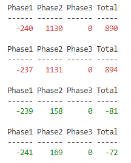

# Display the current power usage from the data of the API of the HomeWizard Wi-Fi P1 Meter




## Usage

You can discover the hostname of your HomeWizard Wi-Fi P1 Meter by running the following commmand in a (PowerShell) terminal:

```cmd
dns-sd -B _hwenergy._tcp .
```

In this example result the hostname is `p1meter-DDEEFF`

```txt
Browsing for _hwenergy._tcp
Timestamp     A/R Flags if Domain                    Service Type              Instance Name
14:46:11.368  Add     2 29 local.                    _hwenergy._tcp.           p1meter-DDEEFF
```
When you run the `Read-P1-meter.ps1` script you will be asked to input the hostname.

The script will run until you exit it by **CTRL + C**.

## Legend

When the Total column is a positive number you are drawing from the grid, when it is a negative number you are feeding back into the grid (a.k.a "the meter spins backwards"). When the total is positive the text is red, when the total is negative (the desired situation: you are generating more power than you are using) the text is green.

| label | API property | Description |
| --- | --- | --- |
| Phase1 | active_power_l1_w | The active usage for phase 1 in Watts
| Phase2 | active_power_l2_w | The active usage for phase 2 in Watts (HWE-P1 returns ‘null’ when connection is single-phase)
| Phase3 | active_power_l3_w | The active usage for phase 3 in Watts (HWE-P1 returns ‘null’ when connection is single-phase)
| Total | active_power_w    | The total active usage in Watts

## Links

- Device: https://www.homewizard.com/p1-meter/
- API Docs: https://homewizard-energy-api.readthedocs.io/index.html
